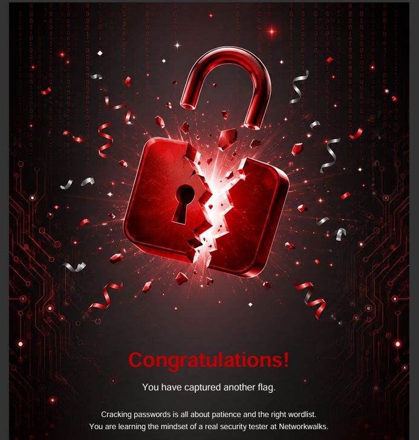
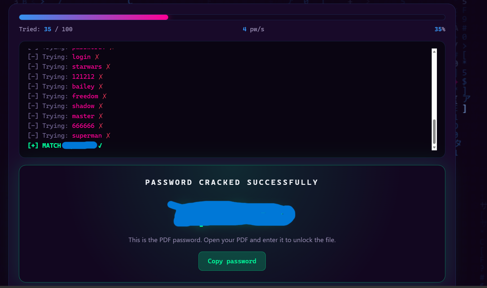
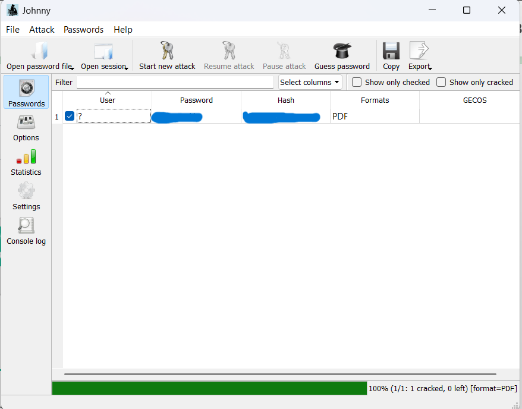

# Week 3 – Password Cracking with John the Ripper

## Cybersecurity & Ethical Hacking – Networkwalks

This repository documents my Week 3 practical project focused on password cracking and password security testing.

## 🎯 Objectives

- Understand password-cracking techniques in a controlled lab
- Use John the Ripper and Johnny for password recovery
- Work with password-protected PDF files
- Understand the role of password hashes in password recovery
- Practice password security testing using an authorized training environment

## 🛠️ Tools Used

- John the Ripper (JTR)
- Johnny GUI
- Networkwalks password-cracking tool
- Windows
- Password-protected PDF

## 🔐 Task 1 – John the Ripper / Johnny

The first task involved recovering the password of a password-protected PDF using John the Ripper and Johnny.

### Workflow

1. Obtained the authorized password-protected PDF provided for the lab.
2. Extracted the PDF password hash.
3. Saved the hash in a text file.
4. Loaded the hash into Johnny.
5. Started the password-cracking attack.
6. Recovered the PDF password.
7. Verified the result by opening the protected PDF.

## 🔑 Task 2 – Networkwalks Password-Cracking Tool

The second task involved using the password-cracking tool provided by Networkwalks.

The tool tested password candidates and identified the correct password during the authorized training exercise.

## 📸 Practical Evidence

### 1. John the Ripper / Johnny – Crack Result

### 2. John the Ripper / Johnny – Second Result

### 3. Networkwalks – Challenge Result

### 4. Networkwalks Password-Cracking Tool

### 6. PDF Password Verification

Sensitive information such as:

- Recovered passwords
- Password hashes
- Challenge flags

has been redacted before publishing.

## 💡 Key Learning

This project provided practical exposure to:

- Password security
- Password hash handling
- John the Ripper
- Johnny GUI
- Password recovery
- Password-strength considerations
- Responsible security testing

The exercise demonstrated why strong and unpredictable passwords are important for protecting sensitive files and accounts.

## ⚠️ Disclaimer

All activities were performed within the authorized Networkwalks training environment.

No unauthorized systems or accounts were targeted.

Sensitive credentials, hashes and challenge flags have been excluded from this repository.
